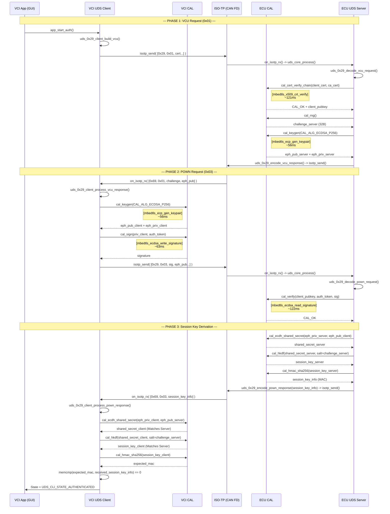

# STM32CubeIDE Integration Guide — UDS 0x29

This document details the exact function-by-function data flow and provides the concrete `main.c` implementations for your dual-board STM32H7 setup using STM32CubeIDE, `mbedtls 2.16.2`, and FDCAN.

---

## 1. Complete Data Flow (Function Trace)



Below is the step-by-step trace of how bytes move from the FDCAN peripheral all the way to the Crypto Abstraction Layer (CAL).

### VCI (Tester) Initiates Authentication
1. **Application (GUI/Button)**: Calls `app_start_auth()`.
2. **Client Init**: `cal_select_mode(CAL_MODE_CLASSICAL)` is called to set the vtable, then `uds_0x29_client_init()`.
3. **UDS Client**: `uds_0x29_client_build_vcu()` constructs the `[0x29][0x01]...` request byte array.
4. **Transport**: `isotp_send()` translates the request into Single Frame (SF) or First/Consecutive Frames (FF/CF).
5. **HAL CAN**: `isotp_instance_t.send_can_frame` callback fires, triggering `HAL_FDCAN_AddMessageToTxFifoQ()`.

### ECU (Server) Receives VCU Request
1. **HAL CAN**: `HAL_FDCAN_RxFifo0Callback()` fires on interrupt.
2. **Transport RX**: Callback calls `isotp_receive_can_frame()`, passing raw CAN bytes.
3. **Transport Assembly**: `isotp_process()` (running in `main()` while loop) sees completion of the ISO-TP message.
4. **Transport Callback**: ISO-TP fires `on_isotp_rx()`, passing the complete 15KB `rx_buffer`.
5. **UDS Core**: `on_isotp_rx` calls `uds_core_process()`.
6. **UDS Dispatch**: `uds_core` reads SID byte (`0x29`) and routes to `uds_0x29_server_process()`.
7. **UDS Decoder**: `uds_0x29_decode_vcu_request()` maps struct pointers to the incoming byte array (zero-copy).
8. **Crypto Verify**: Server process calls `cal_cert_verify_chain()`. The CAL routes this through the active vtable to `classical_cert_verify()`, which uses mbedTLS `mbedtls_x509_crt_verify()`.
9. **Crypto Gen**: Server process calls `cal_keygen()`. The vtable uses `classical_keygen()` to roll ECDH ephemeral keys via `mbedtls_ecp_gen_keypair`.
10. **UDS Encoder**: Server process calls `uds_0x29_encode_vcu_response()` and `isotp_send()`.

### The Rest of the Flow
The exact same path runs for the rest of the flow:
* VCI receives VCU response → `uds_0x29_client_process_vcu_response()` → `cal_sign()` (mbedTLS: `mbedtls_ecdsa_write_signature`).
* ECU receives POWN request → `uds_0x29_server_process()` → `cal_verify()`, `cal_ecdh_shared_secret()`, `cal_hkdf()`, `cal_hmac_sha256()`.
* VCI receives POWN response → `uds_0x29_client_process_pown_response()` → derived `session_key` is identical.

---

## 2. Server (ECU) `main.c` Integration 

Drop this into the ECU board's `main.c`. This assumes `hfdcan1` is initialized by CubeMX.

```c
/* USER CODE BEGIN Includes */
#include "isotp.h"
#include "uds/uds_core.h"
#include "cal/cal_backend.h"
/* USER CODE END Includes */

/* USER CODE BEGIN PV */
#define CAN_ID_ECU_RX  0x701  /* VCI sends to ECU  */
#define CAN_ID_ECU_TX  0x709  /* ECU replies to VCI*/

static isotp_instance_t g_isotp;

/* Optional: Replace with real cert arrays */
static const uint8_t ca_cert_der[] = { ... };

/* UDS response buffer (allocated to stack/static, responses are small <150B) */
static uint8_t g_tx_buf[256];
/* USER CODE END PV */

/* USER CODE BEGIN 0 */

/**
 * @brief ISO-TP callback: Fired when a full UDS message arrives
 */
void on_isotp_rx(uint8_t *data, uint16_t length, isotp_result_t result)
{
    if (result != ISOTP_OK) return;

    uint16_t tx_len = 0;
    
    /* Pass the assembled message into the UDS core dispatcher */
    uds_result_t uds_res = uds_core_process(data, length, g_tx_buf, &tx_len);
    
    if (tx_len > 0) {
        isotp_send(&g_isotp, g_tx_buf, tx_len);
    }
}

/**
 * @brief Hardware link: Send CAN frame (called by isotp_process)
 */
isotp_result_t my_can_send(uint32_t id, const uint8_t *data, uint8_t dlc)
{
    FDCAN_TxHeaderTypeDef tx_hdr = {0};
    tx_hdr.Identifier = id;
    tx_hdr.IdType = FDCAN_STANDARD_ID;
    tx_hdr.TxFrameType = FDCAN_DATA_FRAME;
    tx_hdr.DataLength = FDCAN_DLC_BYTES_8; /* Assuming standard CAN 8 bytes for simple test */
    tx_hdr.ErrorStateIndicator = FDCAN_ESI_ACTIVE;
    tx_hdr.BitRateSwitch = FDCAN_BRS_OFF;
    tx_hdr.FDFormat = FDCAN_CLASSIC_CAN;
    tx_hdr.TxEventFifoControl = FDCAN_NO_TX_EVENTS;
    tx_hdr.MessageMarker = 0;

    if (HAL_FDCAN_AddMessageToTxFifoQ(&hfdcan1, &tx_hdr, (uint8_t*)data) != HAL_OK) {
        return ISOTP_ERROR_BUSY;
    }
    return ISOTP_OK;
}

/**
 * @brief Time source for ISO-TP timeouts
 */
uint32_t my_get_time(void) {
    return HAL_GetTick();
}
/* USER CODE END 0 */


int main(void)
{
  /* Standard CubeMX init */
  HAL_Init();
  SystemClock_Config();
  MX_GPIO_Init();
  MX_FDCAN1_Init();

  /* USER CODE BEGIN 2 */
  
  /* 1. Init Crypto Layer (RNG + Vtables) */
  cal_init();
  cal_select_mode(CAL_MODE_CLASSICAL);

  /* 2. Init UDS Service 0x29 Configuration */
  uds_core_config_t uds_cfg = {
      .auth_cfg = {
          .ca_cert_der = ca_cert_der,
          .ca_cert_len = sizeof(ca_cert_der)
      }
  };
  uds_core_init(&uds_cfg);

  /* 3. Init ISO-TP layer */
  isotp_init(&g_isotp, CAN_ID_ECU_TX, CAN_ID_ECU_RX);
  g_isotp.send_can_frame = my_can_send;
  g_isotp.get_timestamp_ms = my_get_time;
  isotp_set_rx_callback(&g_isotp, on_isotp_rx);

  /* 4. Start CAN filtering and interrupts */
  FDCAN_FilterTypeDef sFilterConfig;
  sFilterConfig.IdType = FDCAN_STANDARD_ID;
  sFilterConfig.FilterIndex = 0;
  sFilterConfig.FilterType = FDCAN_FILTER_MASK;
  sFilterConfig.FilterConfig = FDCAN_FILTER_TO_RXFIFO0;
  sFilterConfig.FilterID1 = CAN_ID_ECU_RX;
  sFilterConfig.FilterID2 = 0x7FF; /* Exact match */
  HAL_FDCAN_ConfigFilter(&hfdcan1, &sFilterConfig);
  HAL_FDCAN_Start(&hfdcan1);
  HAL_FDCAN_ActivateNotification(&hfdcan1, FDCAN_IT_RX_FIFO0_NEW_MESSAGE, 0);

  /* USER CODE END 2 */

  /* Infinite loop */
  /* USER CODE BEGIN WHILE */
  while (1)
  {
      /* Poll ISO-TP state machine. Doing it in while(1) is safer than 
       * doing it inside the RX interrupt, keeping IRQ duration low. */
      isotp_process(&g_isotp);
      
    /* USER CODE END WHILE */
  }
}

/* USER CODE BEGIN 4 */
/**
 * @brief HW CAN RX Interrupt
 */
void HAL_FDCAN_RxFifo0Callback(FDCAN_HandleTypeDef *hfdcan, uint32_t RxFifo0ITs)
{
    FDCAN_RxHeaderTypeDef rx_hdr;
    uint8_t rx_data[8]; // Assuming classic CAN 8 bytes
    
    if (HAL_FDCAN_GetRxMessage(hfdcan, FDCAN_RX_FIFO0, &rx_hdr, rx_data) == HAL_OK) {
        if (rx_hdr.Identifier == CAN_ID_ECU_RX) {
            /* Feed raw bytes into ISO-TP assembler */
            uint8_t dlc_bytes = (rx_hdr.DataLength >> 16); /* Handle FDCAN DLC mapping if needed */
            if (dlc_bytes == 0) dlc_bytes = 8;             /* Fallback for brevity */
            
            isotp_receive_can_frame(&g_isotp, rx_hdr.Identifier, rx_data, dlc_bytes);
        }
    }
}
/* USER CODE END 4 */
```

---

## 3. Client (VCI) `main.c` Integration

Drop this into the VCI board's `main.c`. It initiates the transaction when you press the Blue USER Button (e.g. `B1_Pin`).

```c
/* USER CODE BEGIN Includes */
#include "isotp.h"
#include "uds/uds_0x29_client.h"
#include "cal/cal_backend.h"
#include "uds/uds_session.h"
/* USER CODE END Includes */

/* USER CODE BEGIN PV */
#define CAN_ID_VCI_TX  0x701  /* VCI sends to ECU  */
#define CAN_ID_VCI_RX  0x709  /* ECU replies to VCI*/

static isotp_instance_t g_isotp;

/* Client specific configurations */
static uds_cli_ctx_t g_cli_ctx;
static uds_session_ctx_t g_session;

static const uint8_t vci_cert_der[] = { ... };
static const uint8_t vci_priv[]     = { ... };

/* Temporary working buffer for client requests. Can be large since it's static. */
static uint8_t g_tx_buf[1500];

/* P2 Timeout tracking */
static uint32_t g_p2_timer_start = 0;
static uint32_t g_p2_timeout     = 0;
/* USER CODE END PV */

/* USER CODE BEGIN 0 */
void app_start_auth(void)
{
    /* 1. Build the VCU (0x01) request */
    uint16_t tx_len = 0;
    uds_result_t res = uds_0x29_client_build_vcu(&g_cli_ctx, g_tx_buf, &tx_len, sizeof(g_tx_buf));
    
    if (res == UDS_OK && tx_len > 0) {
        /* 2. Dispatch the First Frame or Single Frame over CAN */
        isotp_send(&g_isotp, g_tx_buf, tx_len);
        
        /* 3. Start the standard P2 Timer (50ms) */
        g_p2_timer_start = HAL_GetTick();
        g_p2_timeout     = UDS_P2_SERVER_MAX;
    }
}

/**
 * @brief ISO-TP callback: Fired when ECU replies
 */
void on_isotp_rx(uint8_t *data, uint16_t length, isotp_result_t result)
{
    if (result != ISOTP_OK) return;

    uint16_t tx_len = 0;
    
    /* VCU Response (0x69 0x01) */
    if (data[0] == 0x69 && data[1] == 0x01) {
        uds_0x29_client_process_vcu_response(&g_cli_ctx, data, length, g_tx_buf, &tx_len, sizeof(g_tx_buf));
        if (tx_len > 0) {
            isotp_send(&g_isotp, g_tx_buf, tx_len); /* Sends POWN (0x03) */
            
            /* Restart standard P2 timer for the next response */
            g_p2_timer_start = HAL_GetTick();
            g_p2_timeout     = UDS_P2_SERVER_MAX;
        }
    }
    
    /* POWN Response (0x69 0x03) */
    else if (data[0] == 0x69 && data[1] == 0x03) {
        uds_0x29_client_process_pown_response(&g_cli_ctx, data, length);
        
        /* Disable timer on completion */
        g_p2_timeout = 0;
        
        /* Verification check */
        if (uds_0x29_client_get_state(&g_cli_ctx) == UDS_CLI_STATE_AUTHENTICATED) {
            /* Auth success! Install AES-256-GCM Session Key */
            uds_session_install_key(&g_session, uds_0x29_client_get_session_key(&g_cli_ctx));
            
            // Trigger TouchGFX UI "Success" event here
        } else {
            // Trigger TouchGFX UI "Failed" event here
        }
    }
    
    /* Negative Response Code (0x7F) */
    else if (data[0] == 0x7F && data[1] == 0x29) {
        uint8_t nrc = data[2];
        if (nrc == UDS_NRC_RESPONSE_PENDING) { /* 0x78 */
            /* Server is grinding crypto! Extend timeout to 5000ms */
            g_p2_timer_start = HAL_GetTick();
            g_p2_timeout     = UDS_P2_STAR_SERVER_MAX;
        } else {
            /* Terminal failure (e.g. InvalidKey, SequenceError) */
            g_p2_timeout     = 0;
            uds_0x29_client_reset(&g_cli_ctx);
            // Trigger TouchGFX UI "Failed" event here
        }
    }
}

/* (Include my_can_send and my_get_time identical to the ECU side here) */
/* USER CODE END 0 */


int main(void)
{
  HAL_Init();
  SystemClock_Config();
  MX_GPIO_Init();
  MX_FDCAN1_Init();

  /* USER CODE BEGIN 2 */
  cal_init();
  cal_select_mode(CAL_MODE_CLASSICAL); // Or CAL_MODE_PQC driven by GUI

  uds_cli_config_t cli_cfg = {
      .cert_der = vci_cert_der,
      .cert_len = sizeof(vci_cert_der),
      .priv_key = vci_priv,
      .priv_key_len = 32
  };
  uds_0x29_client_init(&g_cli_ctx, &cli_cfg);

  isotp_init(&g_isotp, CAN_ID_VCI_TX, CAN_ID_VCI_RX);
  g_isotp.send_can_frame = my_can_send;
  g_isotp.get_timestamp_ms = my_get_time;
  isotp_set_rx_callback(&g_isotp, on_isotp_rx);

  /* CAN Filter for VCI (receives on ID 0x709) */
  FDCAN_FilterTypeDef sFilterConfig;
  sFilterConfig.IdType = FDCAN_STANDARD_ID;
  sFilterConfig.FilterIndex = 0;
  sFilterConfig.FilterType = FDCAN_FILTER_MASK;
  sFilterConfig.FilterConfig = FDCAN_FILTER_TO_RXFIFO0;
  sFilterConfig.FilterID1 = CAN_ID_VCI_RX;
  sFilterConfig.FilterID2 = 0x7FF;
  HAL_FDCAN_ConfigFilter(&hfdcan1, &sFilterConfig);
  HAL_FDCAN_Start(&hfdcan1);
  HAL_FDCAN_ActivateNotification(&hfdcan1, FDCAN_IT_RX_FIFO0_NEW_MESSAGE, 0);

  /* USER CODE END 2 */

  /* USER CODE BEGIN WHILE */
  uint8_t last_btn_state = 1;

  while (1)
  {
      isotp_process(&g_isotp);
      
      /* Check UDS P2 Timeouts */
      if (g_p2_timeout > 0 && (HAL_GetTick() - g_p2_timer_start) >= g_p2_timeout) {
          /* Timeout expired before server responded! */
          g_p2_timeout = 0;
          uds_0x29_client_reset(&g_cli_ctx);
          // Trigger TouchGFX UI "Timeout Error" event here
      }
      
      /* Simple edge-detect for the USER button */
      uint8_t btn_state = HAL_GPIO_ReadPin(B1_GPIO_Port, B1_Pin);
      if (btn_state == 0 /*Pressed*/ && last_btn_state == 1) {
          app_start_auth();
      }
      last_btn_state = btn_state;
  }
  /* USER CODE END WHILE */
}

/* (Include HAL_FDCAN_RxFifo0Callback identical to the ECU here, filtering for CAN_ID_VCI_RX) */
```
