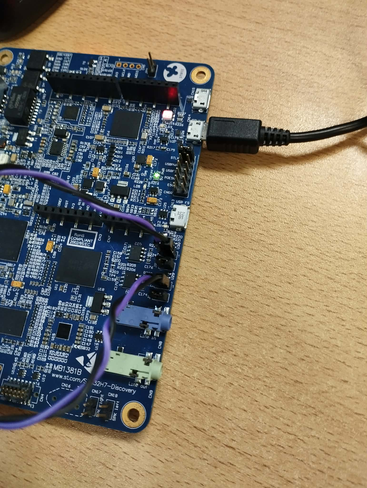
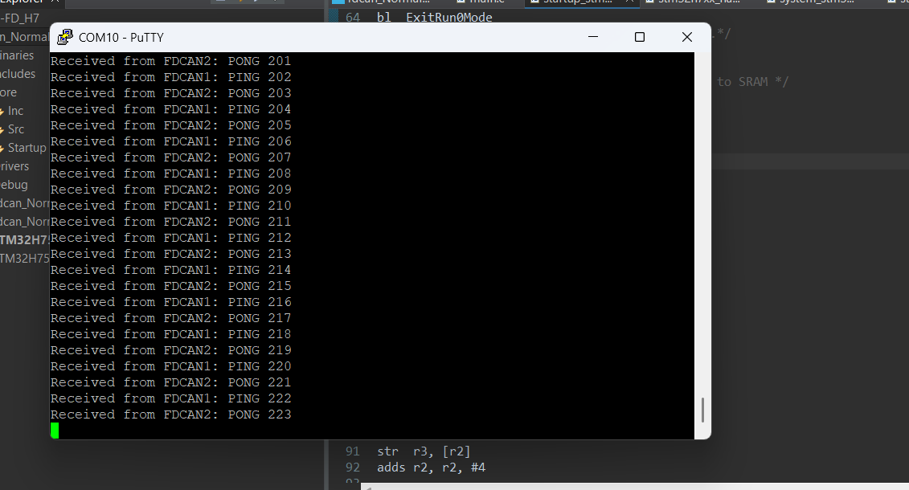

# STM32H750B-DK FDCAN Communication Demo

A ping-pong communication demonstration using two FDCAN (CAN-FD) interfaces on the STM32H750B-DK development board with MCP2562 transceivers.

## 📋 Project Overview

This project demonstrates bidirectional CAN-FD communication between FDCAN1 and FDCAN2 peripherals on the STM32H750B-DK board. The application implements a ping-pong messaging pattern where:

- **FDCAN1** sends "PING" messages every second
- **FDCAN2** receives the messages and responds with "PONG"
- All communication is logged via UART3 for monitoring

## 🔧 Hardware Requirements

- **Development Board**: STM32H750B-DK
- **CAN Transceivers**: 2x MCP2562 (or compatible CAN-FD transceivers)
- **Connections**: FDCAN1 and FDCAN2 connected via transceivers
- **UART**: USART3 for debug output (115200 baud)

## 📊 Hardware Setup

### CAN Connection Diagram

```
STM32H750B-DK                    STM32H750B-DK
┌─────────────┐                  ┌─────────────┐
│   FDCAN1    │                  │   FDCAN2    │
│   TX/RX     │──┐          ┌───│   TX/RX     │
└─────────────┘  │          │   └─────────────┘
                 │          │
            ┌────▼──────────▼────┐
            │   MCP2562 (1)      │
            │   Transceiver      │
            └────┬──────────┬────┘
                 │  CAN_H   │
                 │  CAN_L   │
                 │          │
            ┌────▼──────────▼────┐
            │   MCP2562 (2)      │
            │   Transceiver      │
            └────────────────────┘
```

### Pin Configuration

| Peripheral | Pin | Function |
|------------|-----|----------|
| FDCAN1_TX | PB9 | CAN TX |
| FDCAN1_RX | PH14 | CAN RX |
| FDCAN2_TX | PB13 | CAN TX |
| FDCAN2_RX | PB5 | CAN RX |
| USART3_TX | PB10 | UART Debug TX |
| USART3_RX | PB11 | UART Debug RX |

## 🚀 Features

- **CAN-FD Protocol**: Uses FD CAN format with 12-byte data frames
- **Bidirectional Communication**: Full-duplex ping-pong messaging
- **Interrupt-Driven**: Efficient RX FIFO interrupt callbacks
- **Debug Logging**: Real-time UART output of received messages
- **Message Filtering**: Configured filters for selective message reception

## 📡 CAN Configuration

### FDCAN1 Settings
- **ID**: 0x11 (Standard ID)
- **Frame Format**: FD CAN (no BRS)
- **Data Length**: 12 bytes
- **RX Filter**: Accepts ID 0x22 → FIFO0
- **Mode**: Normal operation

### FDCAN2 Settings
- **ID**: 0x22 (Standard ID)
- **Frame Format**: FD CAN (no BRS)
- **Data Length**: 12 bytes
- **RX Filter**: Accepts ID 0x11 → FIFO1
- **Mode**: Normal operation

### Bit Timing Parameters
- **Nominal Prescaler**: 1
- **Nominal Time Seg1**: 86
- **Nominal Time Seg2**: 13
- **Data Prescaler**: 25

## 💻 Software Flow

```
┌─────────────────────────────────────────────┐
│              System Startup                 │
│  - HAL Init                                 │
│  - Clock Config                             │
│  - GPIO/FDCAN/UART Init                     │
└──────────────────┬──────────────────────────┘
                   │
                   ▼
┌─────────────────────────────────────────────┐
│         Start FDCAN1 & FDCAN2               │
│   Enable RX FIFO Interrupts                 │
└──────────────────┬──────────────────────────┘
                   │
                   ▼
┌─────────────────────────────────────────────┐
│              Main Loop                      │
│                                             │
│  1. FDCAN1 sends "PING X"                   │
│  2. Wait 1 second                           │
│  3. Repeat                                  │
└──────────────────┬──────────────────────────┘
                   │
        ┌──────────┴──────────┐
        │                     │
        ▼                     ▼
┌──────────────┐    ┌──────────────────┐
│ FDCAN2 RX    │    │   FDCAN1 RX      │
│ Callback     │    │   Callback       │
│              │    │                  │
│ - Receive    │    │ - Receive PONG   │
│ - Log UART   │    │ - Log UART       │
│ - Send PONG  │    │                  │
└──────────────┘    └──────────────────┘
```

## 📸 Screenshots

### Board Setup

*STM32H750B-DK board with MCP2562 transceivers connected for FDCAN communication*

### UART Debug Output

*Serial terminal showing successful PING-PONG message exchange*

## 🔨 Building and Running

### Prerequisites
- STM32CubeIDE or compatible ARM GCC toolchain
- STM32CubeMX (for configuration regeneration)
- ST-Link debugger/programmer

### Build Instructions
1. Open the project in STM32CubeIDE
2. Build the project (Ctrl+B)
3. Flash to the STM32H750B-DK board
4. Connect UART3 to a serial terminal (115200 baud)
5. Observe the ping-pong messages

### Expected Output
```
Received from FDCAN1: PING 0
Received from FDCAN2: PONG 0
Received from FDCAN1: PING 1
Received from FDCAN2: PONG 1
Received from FDCAN1: PING 2
Received from FDCAN2: PONG 2
...
```


## 🔍 Key Functions

### `HAL_FDCAN_RxFifo1Callback()`
Handles incoming messages on FDCAN2 (FIFO1):
- Retrieves message from RX FIFO
- Logs to UART
- Sends PONG response
- Reactivates interrupt

### `HAL_FDCAN_RxFifo0Callback()`
Handles incoming messages on FDCAN1 (FIFO0):
- Retrieves message from RX FIFO
- Logs to UART
- Reactivates interrupt


